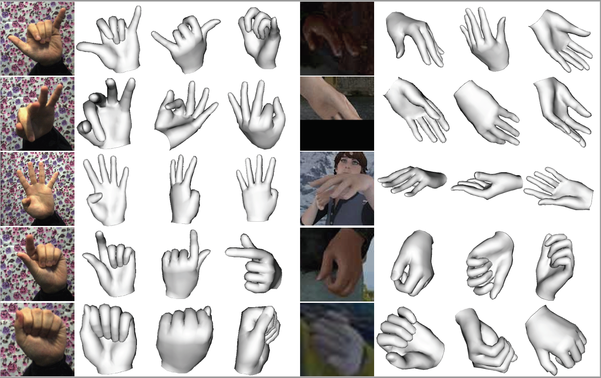

## HAMR
<p align="center">
 
</p>

This repo is the source code for [End-to-end Hand Mesh Recovery from a Monocular RGB Image](https://arxiv.org/abs/1902.09305) by *Xiong Zhang, Qiang Li, Webnbo Zhang*, and *Wen Zheng*. HAMR targets at tackle the problem of reconstructing the full 3D mesh of a human hand from a single RGB image. In contrast to existing research on 2D or 3D hand pose estimation from RGB or/and depth image data, HAMR can provide a more expressive and useful mesh representation for monocular hand image understanding. In particular, the mesh representation is achieved by parameterizing a generic 3D hand model with shape and relative 3D joint angles.


### Citation
If you use this code for your research, please consider citing:
```
@article{zhang2019end,
  title={End-to-end Hand Mesh Recovery from a Monocular RGB Image},
  author={Zhang, Xiong and Li, Qiang and Zhang, Wenbo and Zheng, Wen},
  journal={arXiv preprint arXiv:1902.09305},
  year={2019}
}
```
